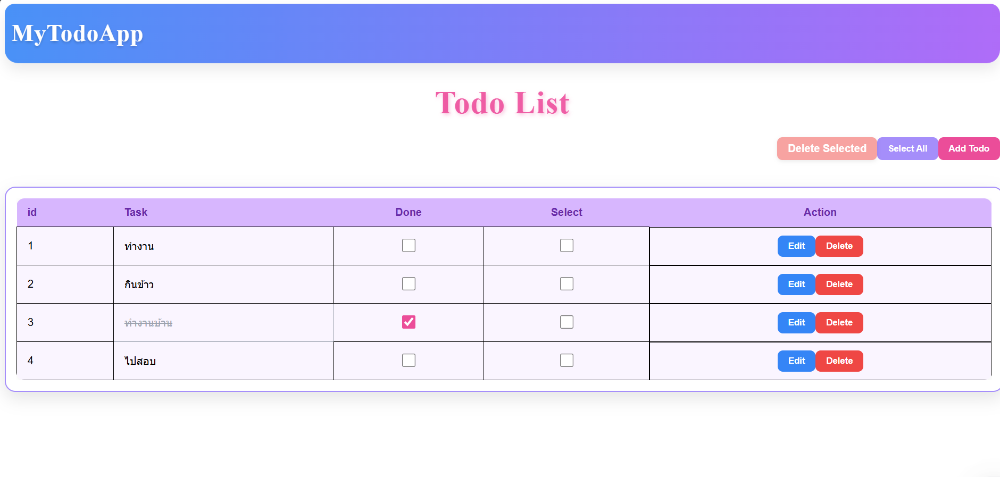

# Fashion Todo List

แอปพลิเคชัน Todo List สไตล์โมเดิร์นและทันสมัย สร้างด้วย **Vue3.js** และ **Tailwind CSS**  
ช่วยให้คุณจัดการงานได้อย่างมีประสิทธิภาพ ด้วยฟีเจอร์เพิ่ม, แก้ไข, ลบ และเลือกงาน พร้อมอินเทอร์เฟซที่สวยงาม

---

## ฟีเจอร์

- เพิ่มงานแฟชั่นใหม่
- แก้ไขงานที่มีอยู่
- ทำเครื่องหมายงานที่เสร็จแล้ว
- ลบงานเดียวหรือหลายงานพร้อมกัน
- เลือก/ยกเลิกเลือกงานทั้งหมด
- การออกแบบ responsive พร้อมพื้นหลัง gradient และสไตล์การ์ด
- โมดอลเพิ่ม/แก้ไขงานแบบมีแอนิเมชัน
- Navbar สวยงามพร้อมพื้นหลัง gradient

---

## ตัวอย่าง



---

---

## การใช้งาน

- กด **Add Todo** เพื่อเพิ่มงานใหม่
- ใช้ **checkbox** เพื่อทำเครื่องหมายว่างานเสร็จแล้ว
- กด **Edit** เพื่อแก้ไขงาน
- กด **Delete** เพื่อลบงาน
- ใช้ **Select All / Deselect All** สำหรับจัดการงานหลายรายการ
- กด **Delete Selected** เพื่อลบงานหลายรายการพร้อมกัน
---

---

## เทคโนโลยีที่ใช้

- Vue.js 3
- Tailwind CSS
- HTML5 / CSS3
- JavaScript
- TypeScript
- Expass.js
- PostgreSQL

---

## การติดตั้ง

1. **โคลน repository:**

```bash
git clone https://github.com/NatanonThunil/To_Do_List.git
cd To_Do_List
#################### ตัวอย่าง env  ########################

#ให้ สร้างไฟล์ .env ในโฟลเดอร์ Backend
DB_HOST=localhost
DB_USER=root
DB_PASSWORD=Password
DB_NAME=to_dolist
DB_PORT=3306
PORT=3000

############################################################
# Code Create Table in SQL
CREATE TABLE `todos` (
  `id` INT AUTO_INCREMENT PRIMARY KEY,
  `title` VARCHAR(255) NOT NULL,
  `completed` TINYINT(1) NOT NULL DEFAULT 0,
  `created_at` TIMESTAMP DEFAULT CURRENT_TIMESTAMP,
  `updated_at` TIMESTAMP DEFAULT CURRENT_TIMESTAMP ON UPDATE CURRENT_TIMESTAMP
) ENGINE=InnoDB DEFAULT CHARSET=utf8mb4;


```
2. **ติดตั้ง :**
```bash
#เข้า Frontend
cd Frontend
npm install
#ออก หน้า Frontend
cd ..
#เข้า Backend
cd Backend
npm install

```
3. **วิธี เปิด Sever:**
```bash
#Frontend
npm run dev

# Backend
npx nodemon --watch 'src/**/*.ts' --exec 'ts-node' src/app.ts

```

